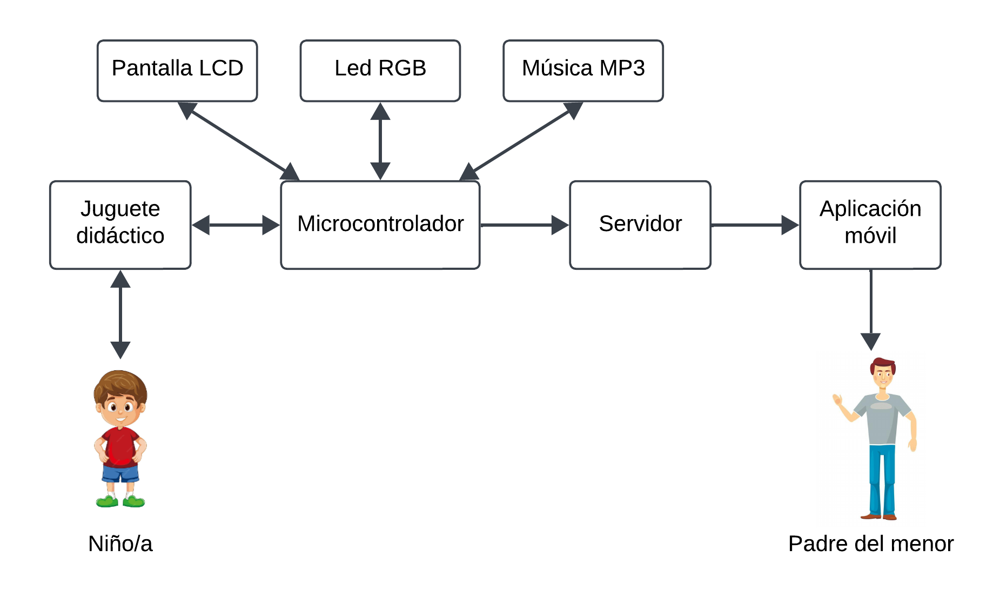

# Juguete Didáctico con Reconocimiento de Colores

## Introducción

El presente proyecto se basa en el desarrollo de un juguete interactivo dirigido a niños mayores de 3 años, diseñado para estimular la memoria visual y mejorar la destreza cognitiva a través del reconocimiento de colores. Este sistema inicia mediante una pantalla LCD con interfaz I2C, permitiendo al usuario seleccionar el nivel de dificultad que prefiera.

Dependiendo del modo de juego seleccionado, un LED RGB servirá de guía para la interacción del niño, quien debe ingresar piezas de colores según la secuencia mostrada. Estas serán detectadas por el sensor de colores integrado, otorgando puntajes por aciertos. La gestión de estos puntajes está a cargo de un microcontrolador ESP32, que transmite los datos en tiempo real a una aplicación móvil diseñada exclusivamente para ser utilizada por los padres, permitiéndoles supervisar el progreso de sus hijos. Además, el juguete ofrece retroalimentación auditiva inmediata mediante un módulo MP3, incentivando el aprendizaje y la mejora continua.

---

## Objetivo General

Desarrollar un juguete didáctico que fomente el aprendizaje de los niños mediante secuencias guiadas de reconocimiento de colores y retroalimentación visual y auditiva, con monitoreo en tiempo real a través de una aplicación móvil para padres.

---

## Objetivos Específicos

- Incorporar un sensor TCS3200 para detectar y reconocer los colores de las piezas ingresadas.
- Crear una aplicación móvil para que los padres supervisen el progreso del niño.
- Optimizar el consumo energético del juguete con un sistema on/off que prolongue la duración de la batería recargable.

---

## Alcance y Limitaciones

El juguete didáctico propuesto ofrece una experiencia interactiva y fácil de usar, diseñada para adaptarse a las necesidades de los niños. Incluye una pantalla LCD y un LED RGB para proporcionar comunicación visual, y un módulo MP3 para retroalimentación auditiva inmediata. La gestión del sistema está a cargo de un microcontrolador, que controlará la lógica del juego, registrará puntajes y enviará información en tiempo real a una aplicación móvil, permitiendo a los padres monitorear el progreso del niño.

### Limitaciones

- El acceso remoto está limitado a redes locales o conexiones específicas, sin soporte para accesos desde ubicaciones remotas.
- No está diseñado para fomentar la interacción entre niños ni para usarse en entornos colaborativos.

---

## Diagrama de Contexto

---

## Diagrama de Bloques del Diseño

*(Insertar diagrama aquí)*

---

## Diagrama de Software

*(Insertar diagrama aquí)*

---

## Diagrama/Diseño de Interfaces

*(Insertar diseño aquí)*

---

## Alternativas de Diseño

Para ejecutar las tareas necesarias dentro del sistema, se optó por la utilización del microcontrolador ESP32 debido a su conectividad integrada y bajo costo, alimentando la pantalla LCD con interfaz I2C, sensor de colores, LED RGB y módulo MP3 debido a su bajo consumo energético.

El **sensor TCS34725** es ideal para el diseño, ya que su filtro de luz IR garantiza alta precisión en diversas condiciones de luz. Además, se adapta perfectamente al juego, al estar diseñado para leer colores en un espacio definido, asegurando detecciones confiables y consistentes. La retroalimentación del sistema será tanto visual, mediante la pantalla LCD con I2C por su fácil conectividad al utilizar una menor cantidad de pines GPIO, como auditiva mediante un buzzer conectado directamente al microcontrolador como alternativa al módulo MP3 para mejorar la eficiencia energética.

La comunicación se realizará mediante WiFi, aprovechando su alcance y facilidad de configuración, permitiendo el monitoreo remoto a través de la aplicación móvil. El sistema será alimentado por una batería recargable externa, proporcionando mayor durabilidad y sostenibilidad al circuito.

---

## Plan de Test y Validación

Las pruebas consistirán en verificar la correcta lectura del sensor de colores, calibrando la intensidad de cada color según las piezas utilizadas por el niño. Esto incluirá comprobar que el sensor detecta adecuadamente las tonalidades y asegurarse de que no haya errores de detección. Además, se validará que la secuencia mostrada por el LED RGB coincida con la detectada por el sensor. También se evaluará el tiempo estimado para completar el circuito y el envío de los datos correspondientes a la aplicación.

---
